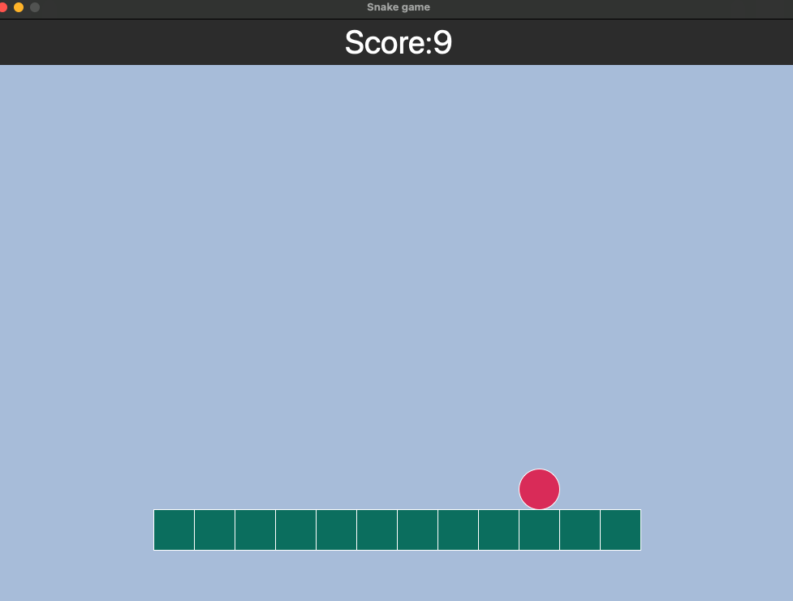

# Snake Game

This is a simple Snake game implemented in Python using the tkinter library.

## About the Game

The Snake game involves controlling a snake that moves around the screen, consuming food to grow. The objective is to avoid collisions with the walls or the snake itself. The game speeds up as the snake grows longer.

## How to Play

- Use the arrow keys (Up, Down, Left, Right) to change the snake's direction.
- The snake will automatically move in the current direction.
- Try to eat the food (red dots) to increase your score.
- The game ends if the snake collides with the walls or itself.

## Instructions to Run

To run the game, make sure you have Python installed. Execute the Python script `snake_game.py` in your preferred Python environment or terminal.
- 'r' Key: Restart the game after game over.

```bash
python snake_game.py


