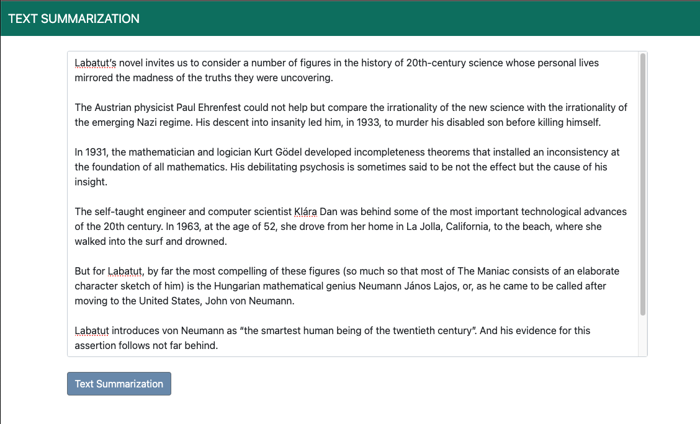
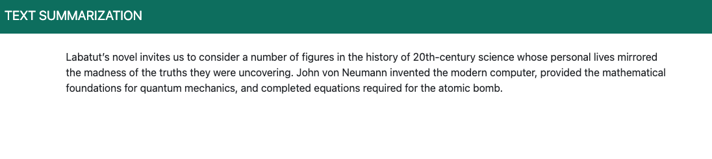

## Text Summarization Web Application

This is a Flask-based web application that utilizes the Hugging Face transformers library to perform text summarization using the BART model. Users can input text, and the application will generate a summary based on that input.

## Features
- Text Summarization: Users can input text into a provided form, and the application will generate a summarized version using the BART model.
- Responsive Design: The web application is designed to be responsive, ensuring a good user experience across various devices.

## Technologies Used
- Flask: Python-based web framework used for the backend server.
- Hugging Face Transformers: Utilized for the BART model and text summarization pipeline.
- Bootstrap 5: CSS framework for styling the web interface.

## Usage
- Clone this repository to your local machine.
- Install the required Python libraries.
- Run python app.py.

